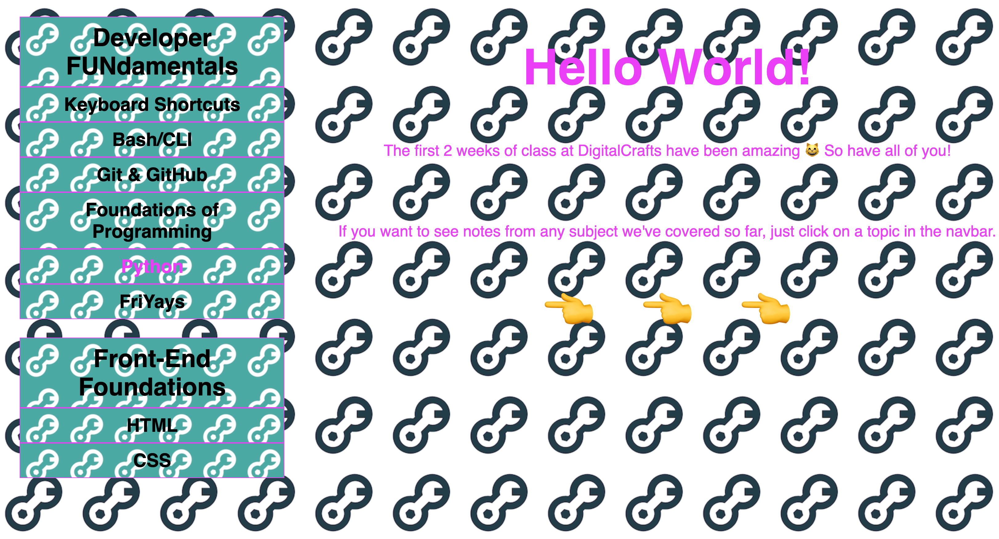

# Class Notes, 90's style

## Contents
- [What It Is](#What-It-Is)
- [What I Used](#What-I-Used)
- [Challenges and Solutions](#Challenges-and-Solutions)
- [Minimum Viable Product](#Minimum-Viable-Product)
- [Stretch Goals](#Stretch-Goals)
- [Screenshots](#Screenshots)
- [Code Examples](#Code-Examples)
## What It Is
The purpose of this assignment was to create a website built on popular design fundamentals...from the 1990's. We used the [Space Jam](https://www.spacejam.com/) website as our template and attempted to build a site that included the [following](https://creativemarket.com/blog/90s-web-designs):
- Repeating Patterned Backgrounds
- Animated and Patterned Navigation
- Too Much Text
- Skeumorphism
- Too Much Content 
- Looping and Overdone Animations
- Hit Counters
- Guestbooks
- Animated Cursors
- Adobe Flash

For my website, I chose to use my class notes as the content. 
## What I Used
- HTML
- CSS
## Challenges and Solutions
## Minimum Viable Product
The minimum viable product for this assignment was to build a single-page static website using web design principles from the 1990's. I chose to experiment with hyperlinks by building a separate page for each section of my notes.
## Stretch Goals
## Screenshots
## Code Examples
## Notes About Contributing

A collaborative, open-source site created by the 2020 March Immersive Cohort at DigitalCrafts in Atlanta, GA. A place where you can:

-Post useful, quality content
-Try new ideas
-Experiment, break things, and build them back up
-Collaborate, share, and learn
-Become better at open-source contributing and teamwork
-Have fun!
